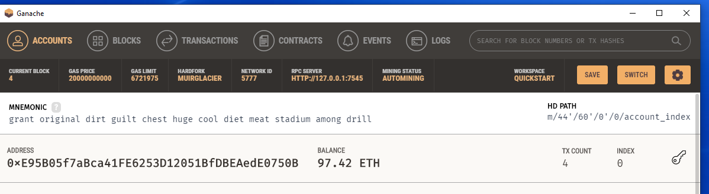
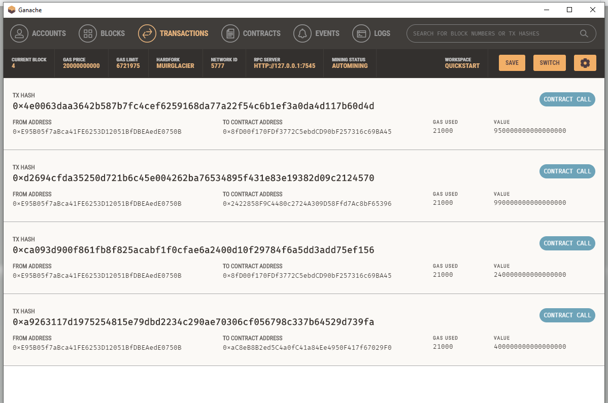

# Fintech_Finder

Integrate Ethereum Blockchain into python application and run application using Streamlit to pay fintech professionals with cryptocurrency. 

Streamlit application main page


Screenshot of the address, balance, and transaction (TX) count of the Ganache account.


Transaction Details showing the transaction:


---

## Technologies

This project uses python 3.7 along with the following packages:

* [Streamlit](https://streamlit.io/) - Streamlit turns data scripts into shareable web apps.

* [web3](https://pypi.org/project/web3/) - A Python library for interacting with Ethereum.

* [bip44](https://pypi.org/project/bip44/) - Simple Python bip44 implementation. Mnemonic + bip32.

* [ganache](https://trufflesuite.com/ganache/) - ​​A program to quickly set up a local blockchain, which can be used to test and develop smart contracts.

---

## Installation Guide

Please install the following before starting the application

```python
  pip install streamlit
  pip install web3
  pip install bip44

```
---

## Usage

Please download the project or clone the project using git clone

Please execute the following on the command line in the project directory:

```python
streamlit run fintech_finder.py
```
streamlit should open automatically in a browser. 
If it does not, please follow the instructions on the command line.

---

## Contributors

Abhishika Fatehpuria (abhishika@gmail.com)

---

## License

MIT
​